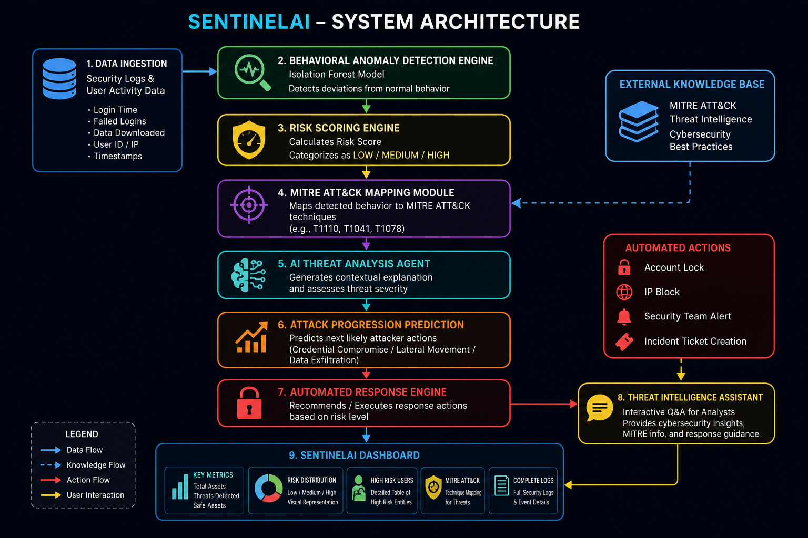
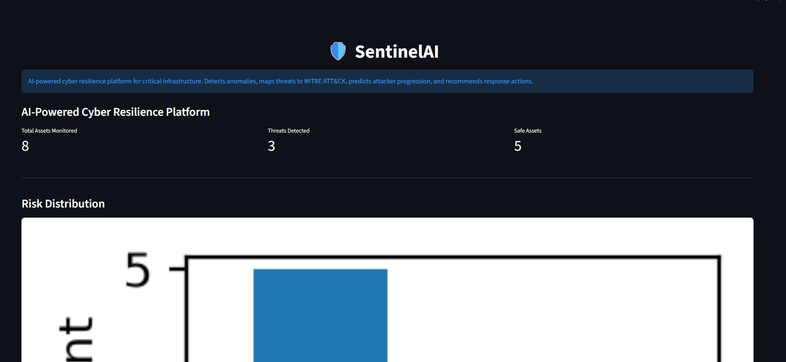
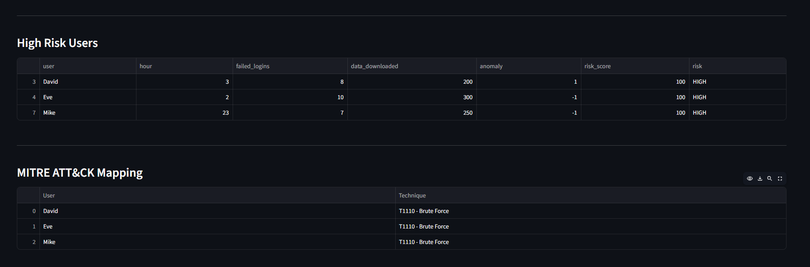
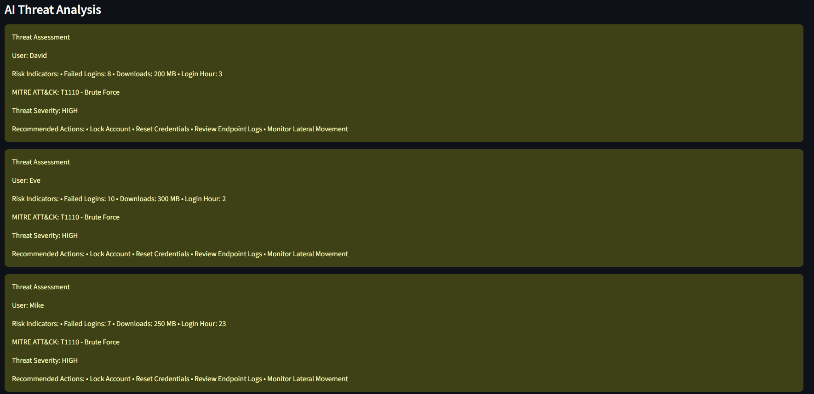
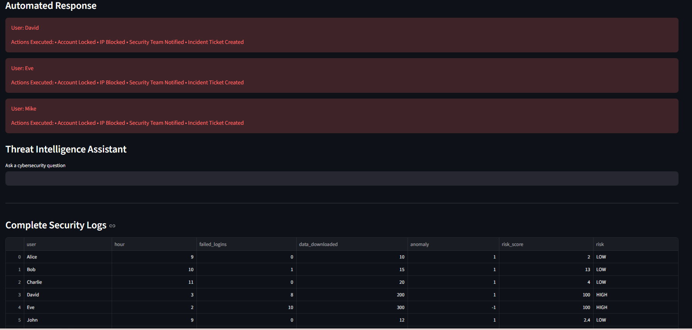

# SentinelAI

## AI-Powered Cyber Resilience Platform for Critical Infrastructure

### Overview

SentinelAI is an AI-driven cybersecurity platform designed to strengthen the cyber resilience of critical national infrastructure. The platform uses behavioral anomaly detection, threat intelligence, MITRE ATT&CK mapping, attack progression prediction, and automated response orchestration to identify and respond to cyber threats before significant damage occurs.

The solution addresses the challenge of detecting Advanced Persistent Threats (APTs) that often evade traditional signature-based security systems.

---

## Problem Statement

Critical infrastructure organizations often rely on legacy systems and reactive security monitoring. Threats are typically detected only after substantial damage has occurred.

SentinelAI reduces the Mean Time to Detect (MTTD) and Mean Time to Respond (MTTR) by combining machine learning, threat intelligence, and automated response mechanisms.

---

## Key Features

### Behavioral Anomaly Detection

* Uses Isolation Forest for anomaly detection.
* Identifies suspicious user behavior without relying on malware signatures.
* Detects unusual login patterns and abnormal data access activities.

### Risk Scoring Engine

* Generates dynamic risk scores based on observed activities.
* Classifies entities into:

  * LOW Risk
  * MEDIUM Risk
  * HIGH Risk

### MITRE ATT&CK Mapping

* Maps suspicious activities to MITRE ATT&CK techniques.
* Supports attack attribution and threat understanding.

### AI Threat Analysis

* Generates human-readable explanations for detected threats.
* Provides contextual recommendations for investigation and remediation.

### Attack Progression Prediction

* Predicts the next likely stage of an attack.
* Helps analysts proactively mitigate threats.

### Automated Response Orchestrator

* Simulates automated containment actions:

  * Account Locking
  * IP Blocking
  * Security Team Notification
  * Incident Ticket Creation

### Threat Intelligence Assistant

* Interactive cybersecurity assistant.
* Answers security-related questions and provides threat intelligence support.

---


## System Architecture



---

## Technology Stack

### Frontend

* Streamlit

### Backend

* Python

### Machine Learning

* Scikit-Learn
* Isolation Forest

### Data Processing

* Pandas

### Visualization

* Matplotlib

### Threat Intelligence

* MITRE ATT&CK Framework
* Gemini AI

---

## Installation

### Clone Repository

```bash
git clone https://github.com/ShristiChaturvedi/SentinelAI.git
cd SentinelAI
```

### Install Dependencies

```bash
pip install -r requirements.txt
```

### Run Application

```bash
python -m streamlit run dashboard.py
```

---

## Evaluation Metrics

| Metric                | Traditional SOC | SentinelAI          |
| --------------------- | --------------- | ------------------- |
| Threat Detection      | Signature-Based | Behavioral Analysis |
| MTTD                  | Days to Weeks   | Minutes             |
| MTTR                  | Hours           | Seconds to Minutes  |
| Threat Prioritization | Manual          | Automated           |
| Response Actions      | Manual          | Automated           |

---
## Dashboard Preview

### Main Dashboard



### Security Monitoring Overview



### AI Threat Analysis



### MITRE ATT&CK Mapping



---

## Business Impact

* Faster threat detection and response.
* Reduced analyst workload.
* Improved protection of critical infrastructure.
* Enhanced cyber resilience.
* Better visibility into attack progression.
* Improved operational efficiency.

---

## Future Enhancements

* Real-Time SIEM Integration
* RAG-Based Threat Intelligence
* Graph-Based Attack Path Analysis
* Threat Actor Attribution
* Cloud-Native Kubernetes Deployment
* Digital Twin Security Simulation

---

## Author

Shristi Chaturvedi

Project developed for a Cybersecurity and AI Innovation Hackathon.

Areas:
- Cybersecurity
- Artificial Intelligence
- Threat Detection
- Security Analytics

### Project Name

SentinelAI – AI-Powered Cyber Resilience Platform for Critical Infrastructure

